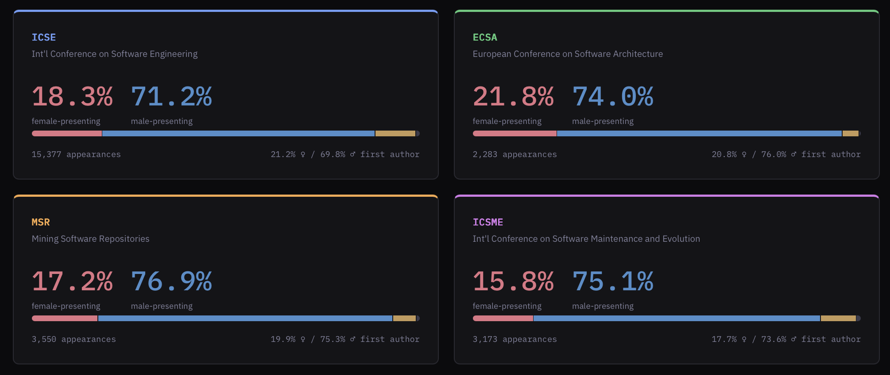
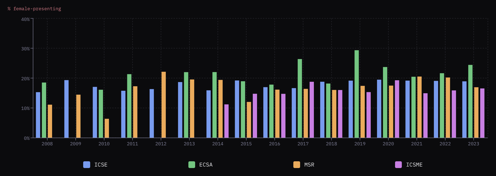
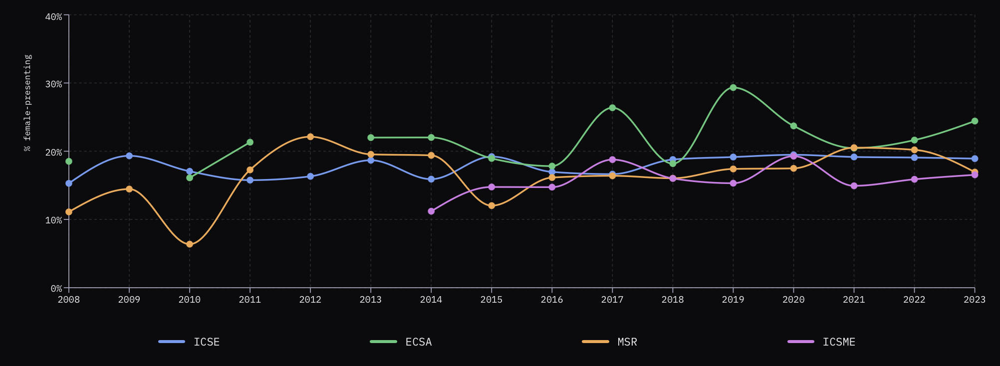
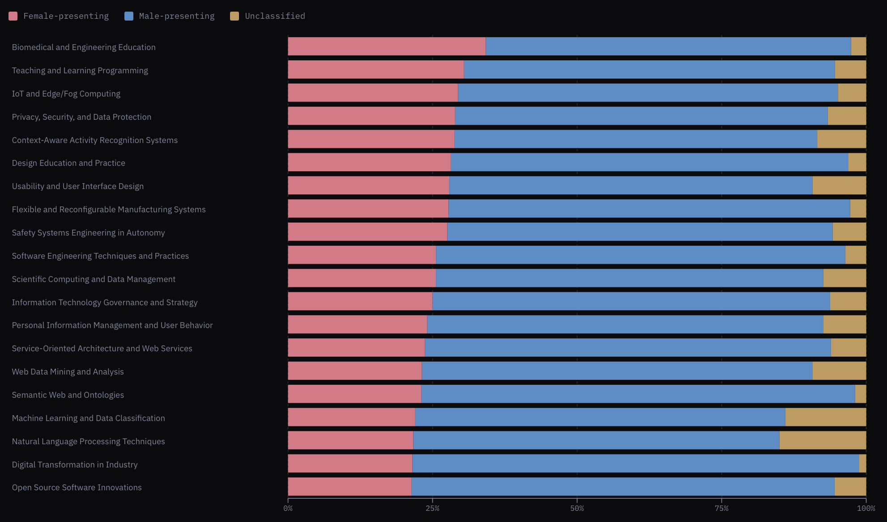

# Phase 2 — Results

## Summary

This project measures how many women authors appear at four major software engineering conferences (ICSE, ECSA, MSR, ICSME) from 2008 to 2023. Across all venues and years, roughly **1 in 5 classified authors presents a female name** — a share that has grown slowly but has not broken past 25% at any venue. The gap is slightly smaller in first-author position (22%), suggesting women who are represented tend to lead papers at a comparable rate to their overall share. Progress exists, but the field remains heavily male-dominated in its publishing record.

---

## Major Findings

- **~20% overall female authorship** — across ~26,000 classified author credits spanning four venues and 15+ years, 19.9% carry a female-presenting first name.
- **Slow upward trend at ICSE** — the largest venue climbed from 18.1% female (2008–2013) to 22.2% (2019–2023), a modest but consistent improvement.
- **ECSA leads all venues** at 24.8% female authorship (2019–2023); ICSME trails at 18.6% over the same window.
- **First-author parity tracks overall share** — 22.3% of first authors present female names, slightly above the all-author rate, meaning women are not disproportionately in middle-author positions.
- **Topic areas matter** — "Teaching and Learning Programming" (32% female) and "IoT / Edge Computing" (31%) skew notably more female than the field average.
- **Formal methods and distributed systems are the least diverse** — "Formal Methods in Verification" (10.5%) and "Distributed Systems and Fault Tolerance" (11.9%) sit well below the field average.
- **Year-to-year variation is high** — single-year spikes and dips of 3–5 percentage points are common, so trend lines matter more than any single year's number.
- **Unclassified names account for ~10–15% of credits** — names that could not be gender-inferred by the pipeline are excluded from percentage calculations; the true rates could differ slightly.

---

## Charts

### Venue Overview

A high-level snapshot of each venue aggregated across all years. **ECSA** has the highest female-presenting share at 21.8%, while **ICSME** is the lowest at 15.8%. Notably, first-author rates closely mirror overall rates at every venue — suggesting women are not being pushed to middle-author positions. **ICSE** is the largest venue by far with 15,377 author appearances, meaning its numbers carry the most statistical weight of the four.

### Venue Comparison Over Time

This bar chart places all four venues side by side for each year, making it easy to spot which venue leads or lags in any given year. **ECSA** (green) is the most visually striking — it regularly peaks above the others and shows the widest swings, particularly the spike to ~30% in 2019. **MSR** (orange) and **ICSME** (pink) tend to cluster at the bottom, rarely pulling ahead. Gaps in the chart (missing bars for a venue in a given year) indicate years where that conference had no data in the dataset. The overall impression is that while there is variation between venues, all four are operating in roughly the same 15–25% band with no venue making a sustained breakout.

### Female authorship trend — all venues combined

### Female authorship trend — per venue

Breaking the trend down by venue reveals that not all conferences move together. **ECSA** consistently sits above the others and shows the most variability year to year, likely due to its smaller author pool. **ICSE**, the largest venue, is the most stable and has crept upward since around 2016. **MSR** and **ICSME** track closely and remain the least diverse of the four, rarely breaking 20%. The dip across most venues around 2010 and again around 2014 is worth noting — both coincide with years of lower overall paper volume.

### Female authorship by research topic

This chart ranks research topics by their share of female-presenting authors. Topics at the top — **Biomedical and Engineering Education**, **Teaching and Learning Programming**, and **IoT / Edge Computing** — have female authorship well above the field average of ~20%. At the bottom sit **Formal Methods in Verification**, **Distributed Systems**, and **Anomaly Detection**, all below 13%. The pattern suggests that topics closer to education, human factors, and applied systems tend to attract more gender-diverse authorship than highly theoretical or systems-level areas.

---

## Methodology Note

Author gender is inferred from first names using the **Genderize.io** API, which assigns a probability-weighted label of female-presenting or male-presenting. Only names where Genderize returned a confidence of `0.70` or above were classified — those below this threshold are counted as `unclassified` and excluded from percentage calculations. Names that Genderize could not recognise at all are labelled `unknown` and also excluded. This means the reported percentages reflect the classified pool only; the true rates across all authors could differ slightly.

Paper metadata was collected from **DBLP** and topic assignments from **OpenAlex**, then cleaned and aggregated into the gold-layer files in `data/gold/`. Name normalisation was applied before inference — HTML entities were decoded and trailing year suffixes were stripped. Author names were also deduplicated across venues so each unique name was only queried once.

It is important to note that this analysis infers gender from names and does not capture self-identified gender. The labels "female-presenting" and "male-presenting" reflect what the API predicts based on name frequencies across cultures — they are an approximation, not a ground truth. Names with ambiguous or cross-cultural gender associations are more likely to be misclassified or fall below the confidence threshold entirely.

---

## Links

- **Paper** — _[link TBD]_
- **Interactive dashboard** — [localhost:5173](http://localhost:5173) _(local only — will be updated to a deployed link)_
- **Pipeline code** — [`src/`](../src/)
- **Gold data** — [`data/gold/`](../data/gold/)

